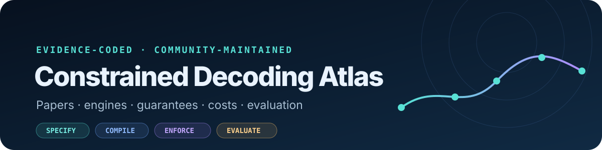

  

**Papers and engines across constrained decoding, organized by what is constrained, where enforcement acts, and what is guaranteed.**

62 papers · 62 read in full · 2017–2026

**[Field snapshot](#field-snapshot)** · **[Papers](#papers)** · **[Libraries](#libraries--engines)** · **[Start here](#start-here)** · **[Taxonomy](docs/taxonomy.md)** · **[Filters](https://rainiver.github.io/constrained-decoding-atlas/)** · **[Contribute](#contributing)**

Extends [Awesome-LLM-Constrained-Decoding](https://github.com/Saibo-creator/Awesome-LLM-Constrained-Decoding),
which lists what exists. Here each work is additionally mapped by **what it constrains, how the
constraint is represented, where enforcement acts, what happens after rejection, what is guaranteed,
and what is measured**. The full catalog is in this README; the website is an optional power-user view.
Updated 2026-08-01 — see [CHANGELOG](CHANGELOG.md).

## Field snapshot

<!-- STATS:START -->
<!-- Generated by scripts/generate_views.py; edit data/papers.json instead. -->

| What gets constrained | Papers | | Where enforcement acts | Papers |
|---|---:|---|---|---:|
| Syntax | 47 (76%) || Token | 48 (77%) |
| Schema | 31 (50%) || Multi-stage | 25 (40%) |
| Semantics | 24 (39%) || Completed sequence | 13 (21%) |
| Lexical | 15 (24%) || **Field / span** | 5 (8%) |
| Types | 5 (8%) || | |
| Relations across fields | 12 (19%) || **What happens to a rejected token** | |
| **Runtime environment state** | 5 (8%) || Masked or pruned | 54 |
| **Policy / authorization** | 1 (2%) || Resampled or regenerated | 11 |
| | || **Repaired in place** | **1** |

**Catalog signal:** 47/62 works constrain syntax and 48/62 intervene token by token, while only 5 model runtime environment state, 12 cross-field relations, 1 policy or authorization, and 1 in-place repair.

*Boundary: 62 papers have been checked against full text; the inventory also includes provisional discovery records. Counts describe this catalog, not field-wide prevalence.*

<!-- STATS:END -->

## Libraries & engines

**Grammar and structured-output engines:** [XGrammar](https://github.com/mlc-ai/xgrammar) ·
[llguidance](https://github.com/guidance-ai/llguidance) ·
[Outlines](https://github.com/dottxt-ai/outlines) ·
[Guidance](https://github.com/guidance-ai/guidance) ·
[Formatron](https://github.com/Dan-wanna-M/formatron) ·
[SynCode](https://github.com/uiuc-focal-lab/syncode) ·
[transformers-CFG](https://github.com/epfl-dlab/transformers-CFG) ·
[GreatGramma](https://github.com/misaelmongiovi/grammarllm) ·
[llama.cpp grammars](https://github.com/ggml-org/llama.cpp/tree/master/grammars) ·
[LM Format Enforcer](https://github.com/noamgat/lm-format-enforcer)

**Control runtimes:** [LMQL](https://github.com/eth-sri/lmql) ·
[SGLang](https://github.com/sgl-project/sglang) ·
[AICI](https://github.com/microsoft/aici) ·
[genlm-control](https://github.com/probcomp/genlm-control) ·
[IterGen](https://github.com/structuredllm/itergen) ·
[Litelines](https://github.com/alonsosilvaallende/litelines) ·
[constrained-diffusion](https://github.com/eth-sri/constrained-diffusion)

**Validation and retry:** [Instructor](https://github.com/567-labs/instructor)

**Hosted:** [OpenAI Structured Outputs](https://openai.com/index/introducing-structured-outputs-in-the-api/) ·
[Gemini structured output](https://ai.google.dev/gemini-api/docs/structured-output)

**Benchmark:** [JSONSchemaBench](https://arxiv.org/abs/2501.10868) compares
coverage, quality, and performance across structured-output engines.

## Start here

| | Paper | Why |
|---|---|---|
| 2021 | [PICARD](https://aclanthology.org/2021.emnlp-main.779/) · EMNLP | An influential template for incremental parsing during decoding. |
| 2024 | [DOMINO](https://proceedings.mlr.press/v235/beurer-kellner24a.html) · ICML | Tokenization and grammars do not align. Naive masking distorts the model. |
| 2024 | [XGrammar](https://arxiv.org/abs/2411.15100) | A widely deployed structured-generation engine with reusable grammar compilation. |
| 2024 | [ASAp](https://arxiv.org/abs/2405.21047) | Shows that masking is not grammar-conditioned sampling and targets the resulting bias. |
| 2025 | [CRANE](https://arxiv.org/abs/2502.09061) | Formalizes when restrictive grammars limit reasoning; interleaves free reasoning with constrained answers. |
| 2025 | [AdapTrack](https://arxiv.org/abs/2510.17376) | `matrix_rank` blocked → model emits `matrix_power`, which it rated 0.20%. |
| 2026 | [The Constraint Tax](https://arxiv.org/abs/2605.26128) | Measures when hard schemas improve validity while reducing executable correctness. |
| 2026 | [Future Validity](https://arxiv.org/abs/2605.07698) | Quantifies the distributional bias introduced by locally masking invalid next tokens. |

## Papers

<!-- CATALOG:START -->
<!-- Generated by scripts/generate_views.py; edit data/papers.json instead. -->

† checked against full text; unmarked discovery records have metadata and link verification only. Detailed evidence status remains available in the filters and JSON data.

### The frontier: constraints that depend on state, relations, or policy

Works addressing state-, relation-, or policy-dependent constraints. 16 of 62 records.

| Year | Work | Constrains | Enforced at | Represented as |
|---:|---|---|---|---|
| 2026 | [Decode-Time Grammars](https://arxiv.org/abs/2607.18357) † | syntax, schema, type +2 | token, field, multi-stage | CFG, token index, oracle |
| 2026 | [XGrammar-2](https://arxiv.org/abs/2601.04426) † | syntax, schema, state | token, field | CFG, PDA, token index |
| 2025 | [ChopChop](https://arxiv.org/abs/2509.00360) † | syntax, type, semantic +1 | token | program, CFG, solver |
| 2025 | [CONFETTI](https://arxiv.org/abs/2506.01859) † | schema, semantic, state | multi-stage | undisclosed |
| 2025 | [Logically Constrained Decoding](https://aclanthology.org/2025.mathnlp-main.11/) † · MathNLP 2025 | syntax, semantic, state | token | program, oracle |
| 2025 | [Syntactic and Semantic Control of Large Language Models via Sequential Monte Carlo](https://arxiv.org/abs/2504.13139) † · ICLR 2025 | syntax, semantic, relation | token, sequence, multi-stage | CFG, program, oracle |
| 2024 | [COLLIE: Systematic Construction of Constrained Text Generation Tasks](https://openreview.net/forum?id=kxgSlyirUZ) † · ICLR 2024 | lexical, syntax, semantic +1 | sequence | CFG, program |
| 2024 | [FANTAstic SEquences and Where to Find Them](https://arxiv.org/abs/2407.13945) † | schema, semantic, relation | token, field | trie, token index |
| 2024 | [IterGen: Iterative Semantic-aware Structured LLM Generation with Backtracking](https://arxiv.org/abs/2410.07295) † · ICLR 2025 | schema, semantic, relation | field, multi-stage | CFG, program |
| 2024 | [Sketch-Guided Constrained Decoding for Boosting Blackbox Large Language Models without Logit Access](https://arxiv.org/abs/2401.09967) † · ACL 2024 | syntax, schema, relation | multi-stage | CFG |
| 2024 | [We Need Structured Output](https://doi.org/10.1145/3613905.3650756) † · CHI Extended Abstracts | syntax, schema, semantic +1 | multi-stage | varies |
| 2023 | [Grammar-Constrained Decoding for Structured NLP Tasks without Finetuning](https://aclanthology.org/2023.emnlp-main.674/) † · EMNLP | syntax, schema, semantic +1 | token | CFG |
| 2023 | [Monitor-Guided Decoding of Code LMs with Static Analysis of Repository Context](https://proceedings.neurips.cc/paper_files/paper/2023/hash/662b1774ba8845fc1fa3d1fc0177ceeb-Abstract-Conference.html) † · NeurIPS 2023 | type, semantic, state +1 | token, field | oracle, program |
| 2022 | [Synchromesh](https://arxiv.org/abs/2201.11227) † · ICLR 2022 | syntax, schema, type +2 | token | oracle, CFG, FSM +1 |
| 2021 | [PICARD: Parsing Incrementally for Constrained Auto-Regressive Decoding from Language Models](https://aclanthology.org/2021.emnlp-main.779/) † · EMNLP 2021 | syntax, semantic, relation | token | CFG, oracle |
| 2019 | [A General-Purpose Algorithm for Constrained Sequential Inference](https://aclanthology.org/K19-1045/) † · CoNLL 2019 | syntax, relation | token | FSM |

### Full catalog

All 62 records, newest first.

| Year | Work | Constrains | Enforced at | Represented as |
|---:|---|---|---|---|
| 2026 | [Accelerating Constrained Decoding with Token Space Compression](https://arxiv.org/abs/2605.29986) † | syntax | token | CFG, PDA, token index |
| 2026 | [Decode-Time Grammars](https://arxiv.org/abs/2607.18357) † | syntax, schema, type +2 | token, field, multi-stage | CFG, token index, oracle |
| 2026 | [Draft-Conditioned Constrained Decoding for Structured Generation in LLMs](https://arxiv.org/abs/2603.03305) † | syntax, schema | token, multi-stage | FSM, CFG |
| 2026 | [Future Validity is the Missing Statistic](https://arxiv.org/abs/2605.07698) † | syntax, schema | token | CFG, FSM, trie |
| 2026 | [Lost in Space](https://aclanthology.org/2026.gem-main.18/) † · GEM 2026 | syntax | token | CFG |
| 2026 | [Mitigating Bias in Locally Constrained Decoding via Tractable Proposals](https://arxiv.org/abs/2606.01926) † · ICML 2026 | lexical, syntax, schema | token, sequence, multi-stage | FSM, token index, program |
| 2026 | [StructEval](https://openreview.net/forum?id=buDwV7LUA7) † · TMLR 2026 | syntax, schema | sequence | varies |
| 2026 | [The Constraint Tax](https://arxiv.org/abs/2605.26128) † | syntax, schema | token, multi-stage | varies |
| 2026 | [Thinking Before Constraining](https://arxiv.org/abs/2601.07525) † | syntax, schema | token, multi-stage | FSM |
| 2026 | [XGrammar-2](https://arxiv.org/abs/2601.04426) † | syntax, schema, state | token, field | CFG, PDA, token index |
| 2025 | [AdapTrack](https://arxiv.org/abs/2510.17376) † | syntax, semantic | token, multi-stage | oracle, program |
| 2025 | [ChopChop](https://arxiv.org/abs/2509.00360) † | syntax, type, semantic +1 | token | program, CFG, solver |
| 2025 | [CONFETTI](https://arxiv.org/abs/2506.01859) † | schema, semantic, state | multi-stage | undisclosed |
| 2025 | [Constrained Decoding of Diffusion LLMs with Context-Free Grammars](https://arxiv.org/abs/2508.10111) † | syntax, schema | token, multi-stage | FSM, CFG |
| 2025 | [Constrained Decoding with Speculative Lookaheads](https://aclanthology.org/2025.naacl-long.239/) † · NAACL 2025 | lexical, semantic | token, multi-stage | classifier, program |
| 2025 | [Constrained Discrete Diffusion](https://arxiv.org/abs/2503.09790) † · NeurIPS 2025 | lexical, semantic | multi-stage | program, solver, classifier |
| 2025 | [CRANE: Reasoning with constrained LLM generation](https://arxiv.org/abs/2502.09061) † · ICML 2025 | syntax, semantic | token, multi-stage | CFG |
| 2025 | [DINGO: Constrained Inference for Diffusion LLMs](https://arxiv.org/abs/2505.23061) † · NeurIPS 2025 | syntax, schema | multi-stage | FSM, program |
| 2025 | [Earley-Driven Dynamic Pruning for Efficient Structured Decoding](https://arxiv.org/abs/2506.01151) † · ICML 2025 | syntax, schema | token | CFG, FSM |
| 2025 | [Efficient and Asymptotically Unbiased Constrained Decoding for Large Language Models](https://arxiv.org/abs/2504.09135) † · AISTATS 2025 | lexical, schema | token, sequence | token index, trie |
| 2025 | [Fast Controlled Generation from Language Models with Adaptive Weighted Rejection Sampling](https://openreview.net/forum?id=3BmPSFAdq3) † · COLM | lexical, syntax, semantic | token, sequence, multi-stage | program, oracle |
| 2025 | [Flexible and Efficient Grammar-Constrained Decoding](https://arxiv.org/abs/2502.05111) † | syntax | token | CFG, FSM, token index |
| 2025 | [Generating Structured Outputs from Language Models](https://arxiv.org/abs/2501.10868) † | schema | token | varies |
| 2025 | [Grammar-Constrained Decoding Makes Large Language Models Better Logical Parsers](https://aclanthology.org/2025.acl-industry.34/) † · ACL 2025 Industry Track | syntax, semantic | token | CFG |
| 2025 | [GRAMMAR-LLM](https://aclanthology.org/2025.findings-acl.177/) † · Findings of ACL 2025 | syntax, schema | token | CFG |
| 2025 | [Logically Constrained Decoding](https://aclanthology.org/2025.mathnlp-main.11/) † · MathNLP 2025 | syntax, semantic, state | token | program, oracle |
| 2025 | [Pre3: Enabling Deterministic Pushdown Automata for Faster Structured LLM Generation](https://aclanthology.org/2025.acl-long.551/) † · ACL 2025 | syntax, schema | token | PDA, token index |
| 2025 | [Syntactic and Semantic Control of Large Language Models via Sequential Monte Carlo](https://arxiv.org/abs/2504.13139) † · ICLR 2025 | syntax, semantic, relation | token, sequence, multi-stage | CFG, program, oracle |
| 2025 | [Syntactic Control of Language Models by Posterior Inference](https://aclanthology.org/2025.findings-acl.1300/) † · Findings of ACL 2025 | syntax | token, sequence, multi-stage | classifier, program |
| 2025 | [The Hidden Cost of Structure](https://aclanthology.org/2025.ranlp-1.124/) † · RANLP | syntax, schema | token | varies |
| 2025 | [Type-Constrained Code Generation with Language Models](https://doi.org/10.1145/3729274) † · PLDI 2025 | type, syntax, semantic | token | FSM, solver, oracle |
| 2025 | [Why is constrained neural language generation particularly challenging?](https://openreview.net/forum?id=Vwgjk5ysWn) † · TMLR | lexical, syntax, semantic | multi-stage | varies |
| 2024 | [Automata-based constraints for language model decoding](https://arxiv.org/abs/2407.08103) † · COLM 2024 | syntax, schema | token | FSM, PDA |
| 2024 | [COLLIE: Systematic Construction of Constrained Text Generation Tasks](https://openreview.net/forum?id=kxgSlyirUZ) † · ICLR 2024 | lexical, syntax, semantic +1 | sequence | CFG, program |
| 2024 | [Constrained Decoding for Fill-in-the-Middle Code Language Models via Efficient Left and Right Quotienting of Context-Sensitive Grammars](https://arxiv.org/abs/2402.17988) † | syntax | token | FSM, CFG |
| 2024 | [FANTAstic SEquences and Where to Find Them](https://arxiv.org/abs/2407.13945) † | schema, semantic, relation | token, field | trie, token index |
| 2024 | [Grammar-Aligned Decoding](https://arxiv.org/abs/2405.21047) † | syntax | token | CFG, trie, token index |
| 2024 | [Guiding LLMs The Right Way](https://proceedings.mlr.press/v235/beurer-kellner24a.html) † · ICML 2024 | syntax, schema | token | FSM, CFG, token index |
| 2024 | [IterGen: Iterative Semantic-aware Structured LLM Generation with Backtracking](https://arxiv.org/abs/2410.07295) † · ICLR 2025 | schema, semantic, relation | field, multi-stage | CFG, program |
| 2024 | [Let Me Speak Freely? A Study on the Impact of Format Restrictions on Performance of Large Language Models](https://arxiv.org/abs/2408.02442) † · EMNLP 2024 Industry Track | syntax, schema | token, multi-stage | CFG, varies |
| 2024 | [Sketch-Guided Constrained Decoding for Boosting Blackbox Large Language Models without Logit Access](https://arxiv.org/abs/2401.09967) † · ACL 2024 | syntax, schema, relation | multi-stage | CFG |
| 2024 | [SynCode: LLM Generation with Grammar Augmentation](https://arxiv.org/abs/2403.01632) † | syntax, schema | token | FSM, CFG, token index |
| 2024 | [We Need Structured Output](https://doi.org/10.1145/3613905.3650756) † · CHI Extended Abstracts | syntax, schema, semantic +1 | multi-stage | varies |
| 2024 | [XGrammar](https://arxiv.org/abs/2411.15100) † | syntax, schema | token | CFG, PDA, token index |
| 2023 | [Don't Fine-Tune, Decode](https://arxiv.org/abs/2310.07075) † | syntax, schema | token | FSM, token index |
| 2023 | [Efficient Guided Generation for Large Language Models](https://arxiv.org/abs/2307.09702) † | syntax, schema | token | FSM, CFG, PDA +1 |
| 2023 | [Grammar-Constrained Decoding for Structured NLP Tasks without Finetuning](https://aclanthology.org/2023.emnlp-main.674/) † · EMNLP | syntax, schema, semantic +1 | token | CFG |
| 2023 | [Monitor-Guided Decoding of Code LMs with Static Analysis of Repository Context](https://proceedings.neurips.cc/paper_files/paper/2023/hash/662b1774ba8845fc1fa3d1fc0177ceeb-Abstract-Conference.html) † · NeurIPS 2023 | type, semantic, state +1 | token, field | oracle, program |
| 2023 | [Prompting Is Programming](https://doi.org/10.1145/3591300) † · PLDI 2023 | lexical, syntax, semantic | token, multi-stage | program, FSM |
| 2023 | [Sequential Monte Carlo Steering of Large Language Models using Probabilistic Programs](https://arxiv.org/abs/2306.03081) † · PADL 2023 | syntax, semantic | token, sequence, multi-stage | program, trie |
| 2023 | [SGLang: Efficient Execution of Structured Language Model Programs](https://arxiv.org/abs/2312.07104) † | syntax, schema | token, multi-stage | FSM |
| 2023 | [Tractable Control for Autoregressive Language Generation](https://arxiv.org/abs/2304.07438) † · ICML 2023 | lexical | token | solver |
| 2022 | [NeuroLogic A*esque Decoding](https://aclanthology.org/2022.naacl-main.57/) † · NAACL 2022 | lexical, semantic | token, multi-stage | program |
| 2022 | [Synchromesh](https://arxiv.org/abs/2201.11227) † · ICLR 2022 | syntax, schema, type +2 | token | oracle, CFG, FSM +1 |
| 2022 | [Validating Large Language Models with ReLM](https://arxiv.org/abs/2211.15458) † | lexical | sequence | FSM |
| 2021 | [Constrained Language Models Yield Few-Shot Semantic Parsers](https://aclanthology.org/2021.emnlp-main.608/) † · EMNLP 2021 | syntax, semantic | token, multi-stage | CFG |
| 2021 | [NeuroLogic Decoding](https://aclanthology.org/2021.naacl-main.339/) † · NAACL 2021 | lexical | sequence | solver, program |
| 2021 | [PICARD: Parsing Incrementally for Constrained Auto-Regressive Decoding from Language Models](https://aclanthology.org/2021.emnlp-main.779/) † · EMNLP 2021 | syntax, semantic, relation | token | CFG, oracle |
| 2019 | [A General-Purpose Algorithm for Constrained Sequential Inference](https://aclanthology.org/K19-1045/) † · CoNLL 2019 | syntax, relation | token | FSM |
| 2019 | [Improved Lexically Constrained Decoding for Translation and Monolingual Rewriting](https://aclanthology.org/N19-1090/) † · NAACL 2019 | lexical | sequence | program, trie |
| 2018 | [Fast Lexically Constrained Decoding with Dynamic Beam Allocation for Neural Machine Translation](https://aclanthology.org/N18-1119/) † · NAACL 2018 | lexical | sequence | program |
| 2017 | [Lexically Constrained Decoding for Sequence Generation Using Grid Beam Search](https://aclanthology.org/P17-1141/) † · ACL 2017 | lexical | sequence | program |

<!-- CATALOG:END -->

## Contributing

[Add a paper](https://github.com/Rainiver/constrained-decoding-atlas/issues/new?template=add-paper.yml) ·
[fix a coding](https://github.com/Rainiver/constrained-decoding-atlas/issues/new) ·
[rules](CONTRIBUTING.md). Edit `data/papers.json`, then `python3 scripts/generate_views.py`.

**Most wanted:** full-text coding for discovery records and corrections to
existing annotations. Unmarked paper titles are the current full-text queue; a
PDF is welcome when no HTML version exists.

## Data & scope

Curated and broad, not a systematic census. The Atlas covers 2017–2026 across
formal-language decoding, probabilistic inference, serving systems, benchmarks,
and runtime enforcement. Snapshot counts describe this catalog, not the whole
field. [Methodology](docs/methodology.md) · [JSON data](data/papers.json) ·
[filterable site](https://rainiver.github.io/constrained-decoding-atlas/).

The README dagger shows whether full text has been checked; the exact review
state remains available in the machine-readable data and filterable site.

Seeded from [Awesome-LLM-Constrained-Decoding](https://github.com/Saibo-creator/Awesome-LLM-Constrained-Decoding)
by [Saibo Geng](https://github.com/Saibo-creator) and contributors — go there for the broader list.

Code [MIT](LICENSE) · annotations [CC BY 4.0](DATA_LICENSE.md) · no paper text redistributed.
